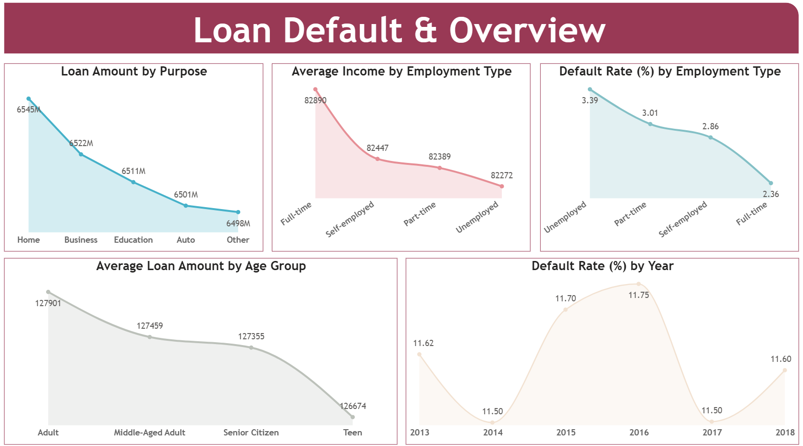
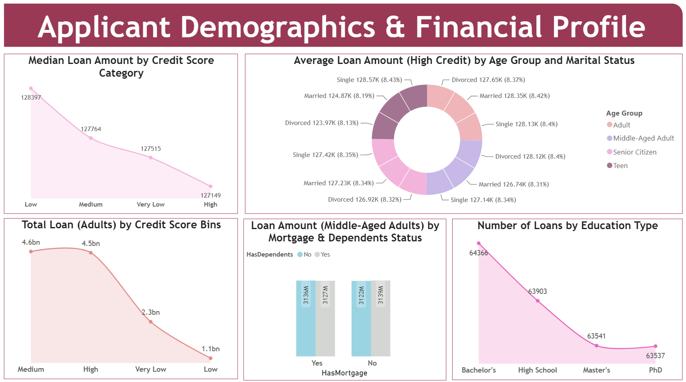
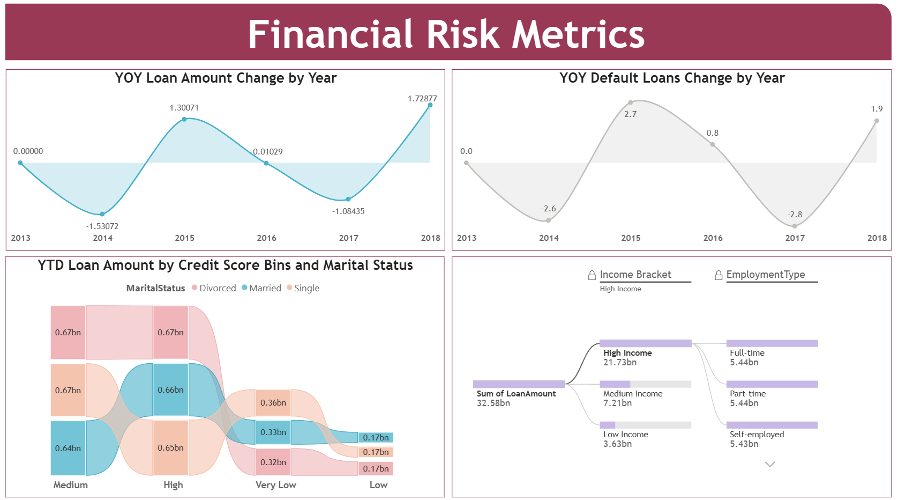

# Loan Default Risk Analysis — Power BI Dashboard
 
An end-to-end Power BI project analyzing loan default risk, applicant demographics, and financial behavior using a dataflow-driven pipeline from Microsoft SQL Server into Power BI Service. The dashboard surfaces who is most likely to default, how loan amounts and risk shift across employment types and credit profiles, and how default trends move year over year.
<br>
 
## Project Overview
 
This project explores a loan portfolio dataset to answer three core business questions:
 
- **Who defaults, and why?** — relating default rates to employment type, credit score, and income.
- **Where is the money going?** — loan amounts broken down by purpose, age group, marital status, and education.
- **How is risk trending over time?** — year-over-year movement in both loan volume and default counts.

The end result is a 3-page interactive Power BI report built on a clean, type-corrected dataset sourced through a Dataflow.
<br>

 ## Data Source & Architecture

Data originates in a SQL Server database (`Loan.dbo.Loan_default`) and is staged through a **Power BI Dataflow**, which handles the upstream transformations before the dataset is loaded into the report layer. This keeps the heavy transformation logic centralized and reusable, rather than rebuilt every time the report is refreshed.

The source data was clean, with no missing values or structural inconsistencies — the transformations below were applied purely to optimize data types and improve usability downstream.

The Dataflow is configured with **scheduled refresh** on the full dataset to keep the report current, alongside **incremental refresh** partitioned on `Loan_Date_MM_DD_YYYY` — so historical data loads once and only new/changed records are refreshed going forward, keeping refresh times efficient as the dataset grows.
<br>

## Data Cleaning & Transformation
 
Transformations were split across two layers:
 
**In the Dataflow (Power Query, Dataflow settings):**
- Converted `Age`, `MonthsEmployed`, `NumCreditLines`, and `LoanTerm` from **Decimal Number → Whole Number**, since these are inherently count-based, non-fractional fields.

**In Power BI Desktop (Power Query Editor):**
- Converted `Default` from **Text → Boolean**, enabling it to be used as a logical flag (`TRUE` = default, `FALSE` = no default) in DAX measures and visuals.
- Renamed `Loan_Date_DD_MM_YYYY` to **`Loan_Date_MM_DD_YYYY`** to accurately reflect the actual date format present in the data.

This two-layer approach keeps reusable, source-level fixes in the Dataflow (so any future report built on this data inherits them automatically) while keeping report-specific adjustments local to the .pbix file.
<br>

## DAX Measures
 
DAX measures are organized into a separate measures table on each report page for clarity and maintainability. The dashboard uses 17 measures spanning calculated columns, time intelligence, and risk aggregations — a few representative examples below; the full list lives in [`dax-measures.dax`](dax-measures.dax).
 
```dax
Age Groups =
IF('Loan_default'[Age] <= 19, "Teen",
    IF('Loan_default'[Age] <= 39, "Adult",
        IF('Loan_default'[Age] <= 59, "Middle-Aged Adult", "Senior Citizens")))
 

Default Rate by Employment Type =
VAR totalrecords = COUNTROWS(ALL('Loan_default'))
VAR DefaultCases = COUNTROWS(FILTER('Loan_default', 'Loan_default'[Default] = TRUE()))
RETURN
    CALCULATE(DIVIDE(DefaultCases, totalrecords), ALLEXCEPT('Loan_default', 'Loan_default'[EmploymentType])) * 100

 
YOY Loan Amount Change =
DIVIDE(
    CALCULATE(SUM('Loan_default'[LoanAmount]),
        'Loan_default'[Year] = YEAR(MAX('Loan_default'[Loan_Date_MM_DD_YYYY]))) -
    CALCULATE(SUM('Loan_default'[LoanAmount]),
        'Loan_default'[Year] = YEAR(MAX('Loan_default'[Loan_Date_MM_DD_YYYY])) - 1),
    CALCULATE(SUM('Loan_default'[LoanAmount]),
        'Loan_default'[Year] = YEAR(MAX('Loan_default'[Loan_Date_MM_DD_YYYY])) - 1), 0
) * 100

```
<br>

## Report Pages & Insights
 
### Page 1 — Loan Default Overview
---


**Visuals:** Loan Amount by Purpose · Average Income by Employment Type · Default Rate (%) by Employment Type · Average Loan Amount by Age Group · Default Rate (%) by Year
 
**What it shows:**
- Loan amounts are fairly evenly spread across purposes — **Home (6,545M)** leads marginally, followed by Business, Education, Auto, and Other — suggesting the portfolio isn't overconcentrated in any single lending category.
- **Unemployed applicants default at the highest rate (3.39%)**, while **Full-time employees default the least (2.36%)**, and average income tracks the same pattern (Full-time earns the most). Employment stability is a clear, intuitive risk signal here.
- Average loan amount is highest for **Adults** and drops steadily through Middle-Aged Adults, Senior Citizens, down to Teens — younger and older borrowers tend to take smaller loans.
- **Default rate by year is cyclical**, peaking around **2015–2016 (~11.7%)** and dipping in **2014 and 2017 (~11.5%)**, rather than trending consistently up or down — pointing to macro or seasonal effects rather than a structural worsening of credit quality.
<br>

 
### Page 2 — Applicant Demographics & Financial Profile
---

 
**Visuals:** Median Loan Amount by Credit Score Category · Average Loan Amount (High Credit) by Age Group & Marital Status · Total Loan (Adults) by Credit Score Bins · Loan Amount (Middle-Aged Adults) by Mortgage & Dependents Status · Loans by Education Type
 
**What it shows:**
- Median loan amount **decreases as credit score improves** (Low: 128,397 → High: 127,149) — counterintuitive at first glance, but it suggests higher-credit borrowers may be taking more conservative, right-sized loans relative to their risk profile rather than maximizing borrowing capacity.
- Across age groups and marital statuses, average loan amounts are **remarkably balanced (all within ~124K–128K)** — marital status and age group alone don't appear to be strong differentiators in loan sizing.
- **Total loan volume drops sharply as credit score bin worsens** — Medium and High bins each hold roughly 4.5–4.6bn, while Very Low and Low bins fall to 2.3bn and 1.1bn respectively. This reflects tighter lending criteria (or self-selection) for lower-credit applicants.
- Mortgage and dependents status show **almost no impact** on loan amounts for Middle-Aged Adults (3.1bn across all combinations) — these factors don't appear to meaningfully influence how much this group borrows.
- **Loans by Education Type** decline from Bachelor's (63,903) down to Master's/PhD (~63,540) — a relatively flat distribution, implying education level is not a major loan volume driver in this dataset.
<br>

 
### Page 3 — Financial Risk Metrics
---

 
**Visuals:** YOY Loan Amount Change by Year · YOY Default Loans Change by Year · YTD Loan Amount by Credit Score Bins & Marital Status (Ribbon Chart) · Sum of Loan Amount by Income Bracket & Employment Type (decomposition tree)
 
**What it shows:**
- **YOY Loan Amount Change** mirrors the default cycle from Page 1 — dips in 2014 (-1.53%) and 2017 (-1.08%), recovering sharply by 2018 (+1.73%). Lending volume contracts in the same years defaults rose, consistent with lenders tightening issuance in riskier years.
- **YOY Default Loans Change** follows a similar but inverted-looking rhythm — rising in 2015 (+2.7%) and 2018 (+1.9%), dropping in 2014 (-2.6%) and 2017 (-2.8%) — reinforcing that 2014 and 2017 were comparatively healthier years for the portfolio.
- The **Ribbon chart** shows credit score migration tightly clustered between Medium and High bins (~0.64–0.67bn flows), with much thinner flows into Very Low and Low — most YTD loan value sits with stronger-credit borrowers, and that value is split fairly evenly across Married, Single, and Divorced applicants.
- The **Decomposition tree** breaks Sum of LoanAmount (32.58bn total) by Income Bracket → Employment Type, showing **High Income / Full-time** as the dominant combination, while **Low Income** segments contribute comparatively little. Within High Income, Part-time employment alone still pulls in 5.44bn — worth a closer look at why.
<br>


